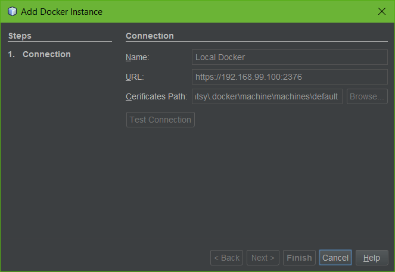

# Docker in NetBeans IDE

NetBeans IDE provides greate Docker integration, it is easy to manage Docker images and containers in IDE.

## Connect to Docker Machine

Make sure at least one Docker Machine is running. We will try to connect to the **default** machine in this post.

1. Starts up NetBeans IDE.
2. In NetBeans IDE, switch to *Services* panel.
3. Click **Add Docker** in the Docker context menu, it will open the *Add Docker* wizard.

   
   
   Use the default value in this wizard.
   
   |---|---|
   |Name|Local Docker|
   |URL|https://192.168.99.100:2376|
   |Certificates Paths|<user home>/.docker/machine/machines/default|
   
   You can choose a different machine and fill its runtime URL. 
   
   Click *Finish* button, it will check the connection and the added docker host will be shown in the *Service* panel.
   
4. Expand the **Docker** node in *Service* panel.

   